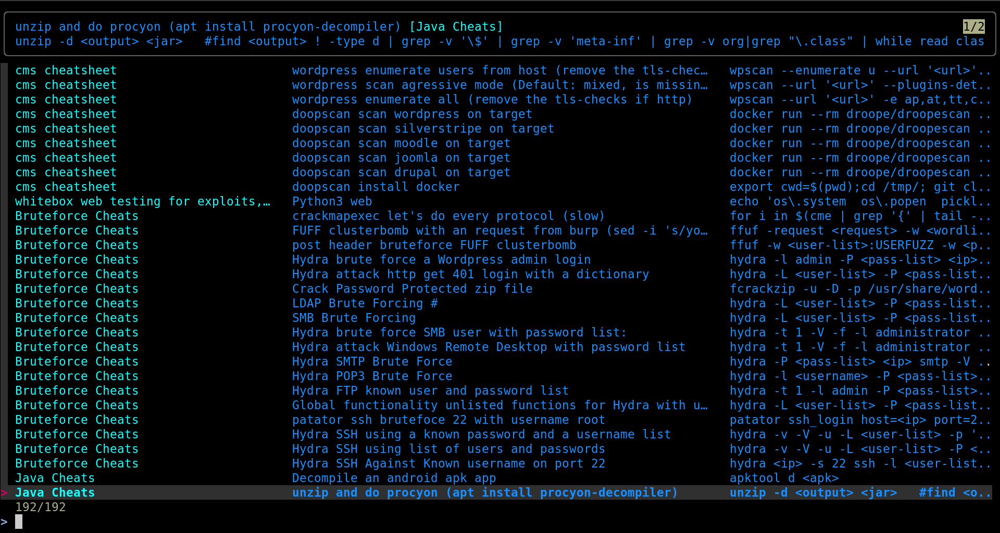

# cheat.sheets

A directory of cheat sheets to use with TLDR, cheat.sh, or Navi.

## Installing

1. Install the interactive tools:

    `$ nix shell --impure -I nixpkgs=channel:nixos-unstable --expr 'with import (builtins.findFile builtins.nixPath "nixpkgs") { config.allowUnfree = true; }; [ nix ]' -c nix profile install --impure -I nixpkgs=channel:nixos-unstable --expr 'import (builtins.findFile builtins.nixPath "nixpkgs") { config.allowUnfree = true; }' fd fzf github:esp0xdeadbeef/cheat.sheets#navi`

1. Add the pentest cheat sheets by adding the repo to navi:

    `$ navi repo add esp0xdeadbeef/cheat.sheets`

1. Check out the [infosecstreams cheat.sheets!](https://github.com/infosecstreams/cheat.sheets) :)


### Installing the shell widget

If you want to the shell widget (hint: you do), add this line to your `.bashrc`_**-like**_ file:

```shell
# bash
echo 'eval "$(navi widget bash)"' >> .bashrc

# zsh
echo 'eval "$(navi widget zsh)"' >> .zshrc

# fish
navi widget fish | source
```

You should restart your shell session. Now when you press `ctrl+g` and you should get a list of all the shortcuts!

## Running

1. Run `navi`:

    `$ navi` or press `ctrl+g` if you installed the widget.

## Resources

- [nix-for-offensive-security](https://github.com/esp0xdeadbeef/nix-for-offensive-security)

### Seeing the command before running it

The normal `navi` flow should show the command/snippet next to the description. If it only shows the descriptions, check your fzf overrides. An override such as `--with-nth 1,2` hides the snippet/command column. Use `--with-nth 1,2,3` or remove `--with-nth` entirely.

Quick config fix:

```shell
mkdir -p ~/.config/navi
cat > ~/.config/navi/config.yaml <<'EOF'
style:
  tag:
    width_percentage: 20
    min_width: 14
  comment:
    width_percentage: 36
    min_width: 28
  snippet:
    color: white
finder:
  command: fzf
  overrides: "--with-nth 1,2,3 --preview 'echo {}' --preview-window=down:70%:wrap"
shell:
  command: bash
EOF
```

If global fzf options are hiding columns, clear or override them:

```shell
unset FZF_DEFAULT_OPTS
navi
```

If you want the old behavior where the selected command is inserted into your shell prompt and you press Enter yourself, use the shell widget:

```shell
# current zsh session
eval "$(navi widget zsh)"

# make it permanent
echo 'eval "$(navi widget zsh)"' >> ~/.zshrc
```

Then go to an empty prompt, press `Ctrl` and `g` together, select the command, and press Enter once to insert it. Press Enter again to run it.

The patched Navi package from this repo also supports typed interactive insertion for zsh and fish after the widget is loaded:

```shell
# zsh or fish after loading the widget
navi
navi --query nmap
```

Bash keeps the upstream `Ctrl+G` prompt-insertion flow. A typed `navi` command in bash can print the selected command without running it, but bash cannot put it back into the Readline prompt after Enter without replacing the Enter binding.

# Final Result :

